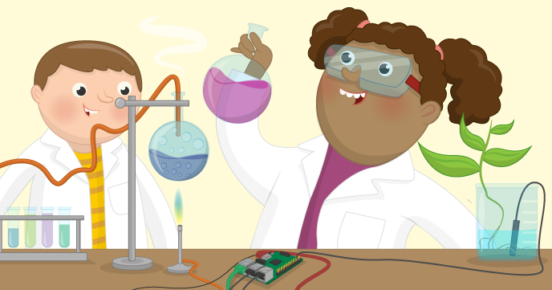

# Sensing Science

In this resource, students will investigate various concepts from Physics, Chemistry and Biology, using the Raspberry Pi and a Sense HAT. This resource contains lessons appropriate for KS3 and KS4 students, although some may require more supervision than others.

## Licence

Unless otherwise specified, everything in this repository is covered by the following licence:

***Sensing Science*** by the [Raspberry Pi Foundation](http://www.raspberrypi.org) is licenced under a [Creative Commons Attribution 4.0 International License](http://creativecommons.org/licenses/by-sa/4.0/).

Based on a work at https://github.com/raspberrypilearning/sensing-science
