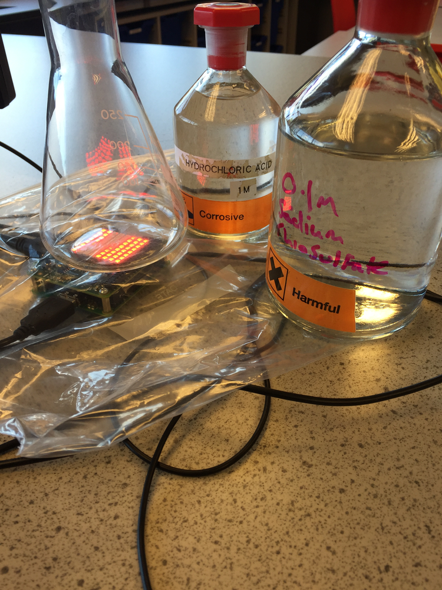
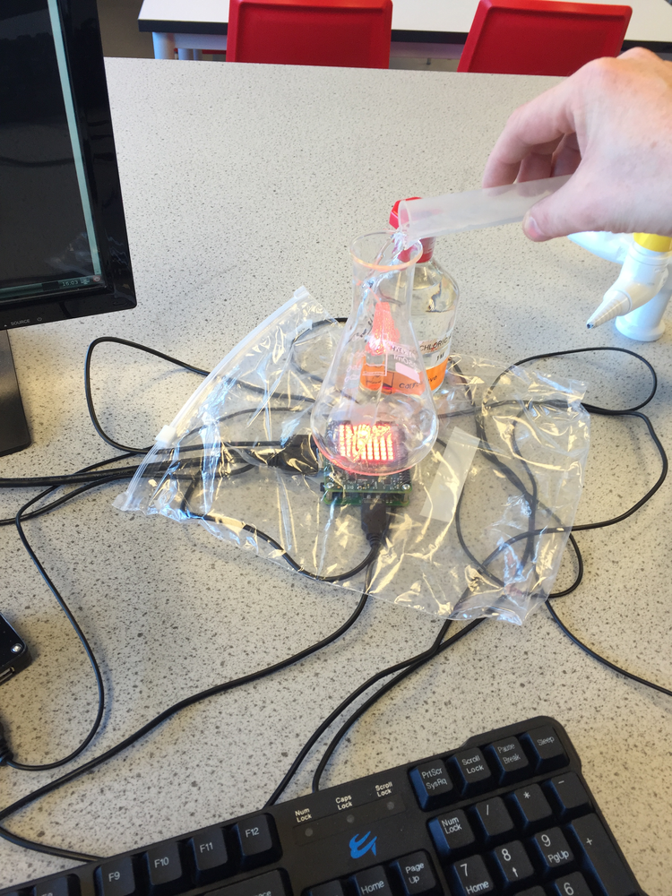
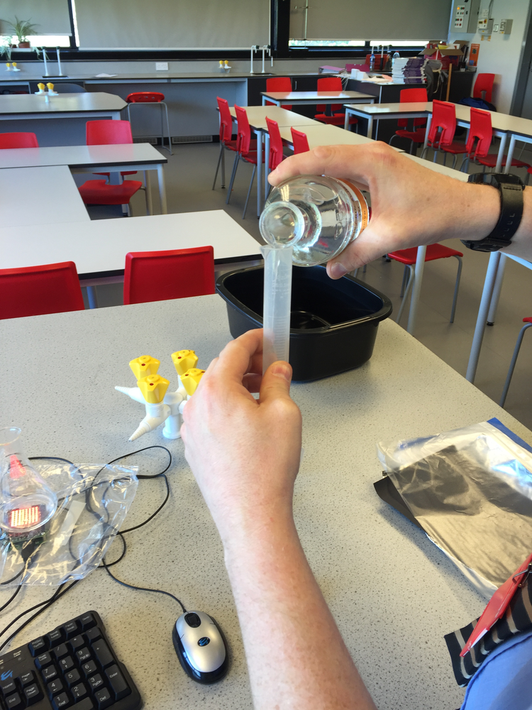
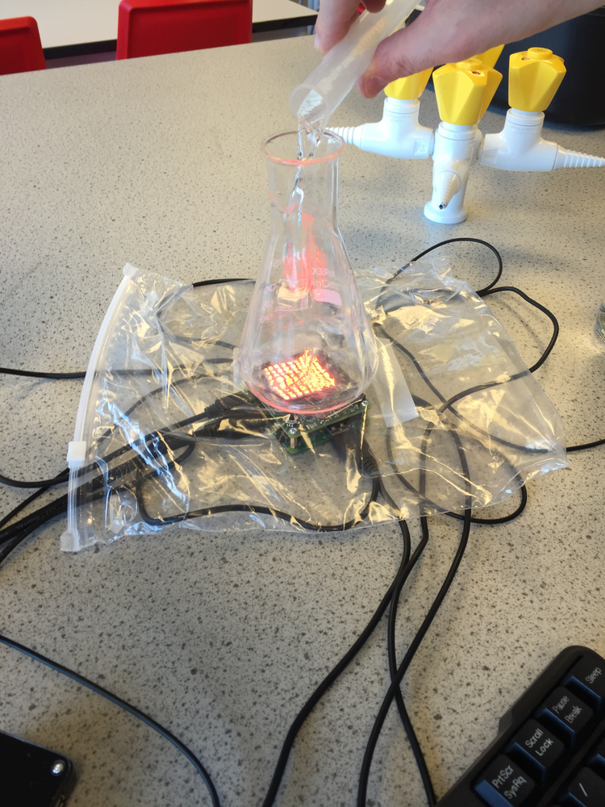
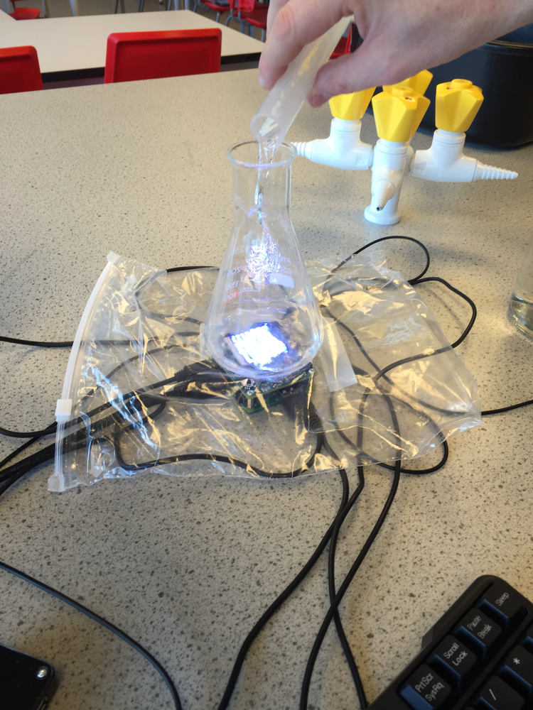
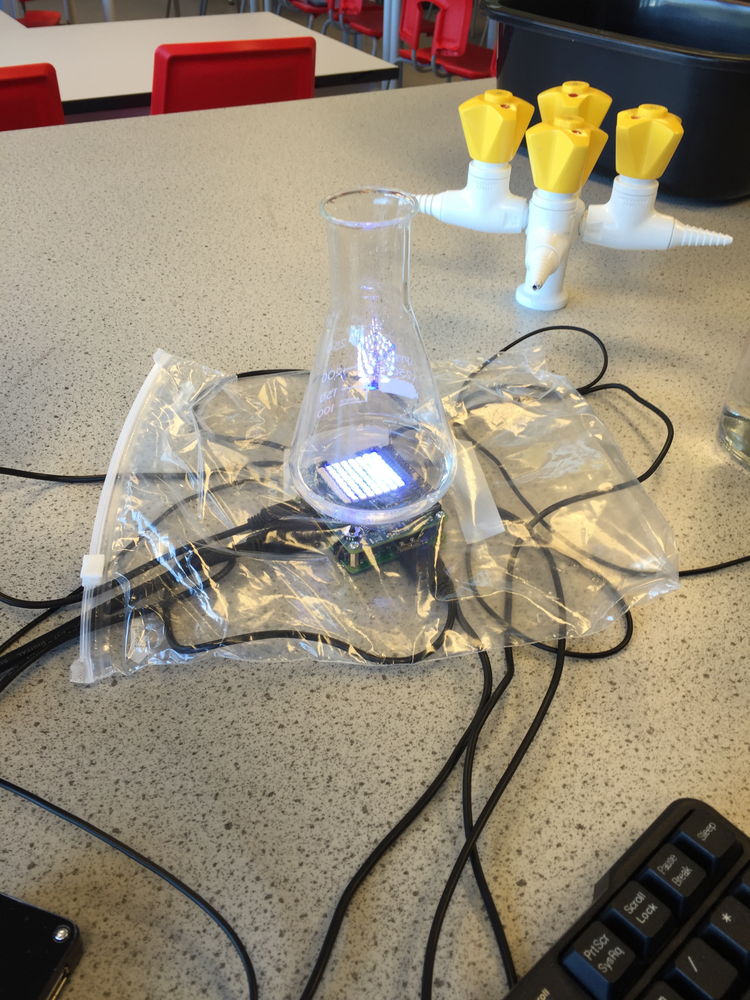
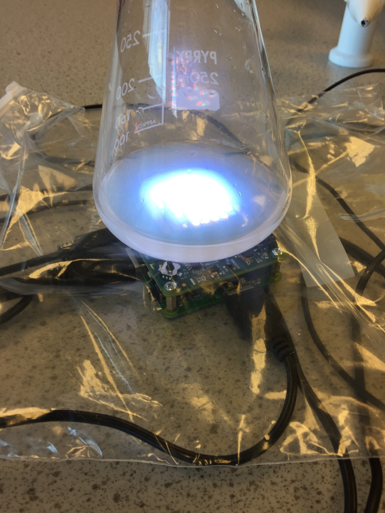
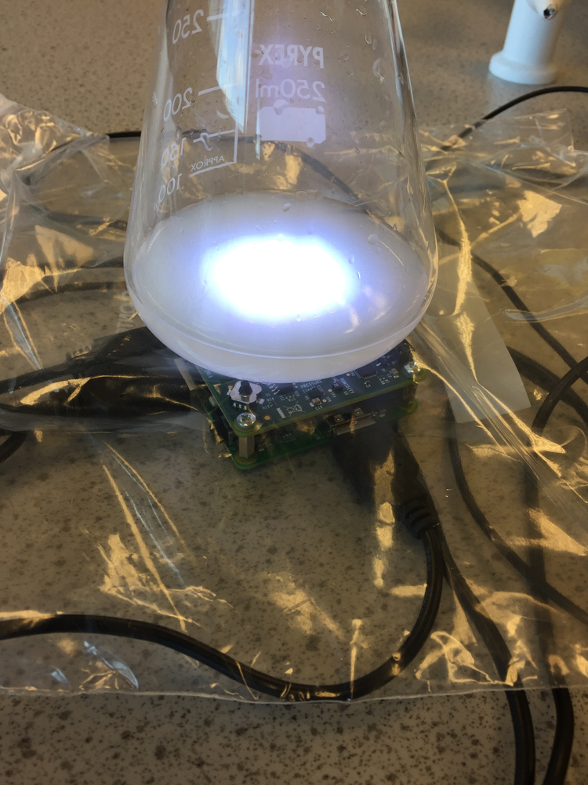

#Investigating rates of chemical reactions

In this lesson, students will investigate the factors that affect the rate of chemical reaction between hydrochloric acid and sodium thiosulphate solution.

##Learning objectives

- Understand that chemical reactions occur when there are successful collision between reacting particles
- Understand that temperature and concentration affect the rate of chemical reaction and that this can be explained through a particle model

##All students are able to

- Identify the factors that affect the rate of chemical reaction

##Most students are able to

- Carry out an investigation to measure how long a reaction takes at different temperatures and or concentrations
- Present results in a suitable table and graph
- Explain how different factors affect the rate of reaction

##Some students are able to

- Calculate the rate of chemical reaction based on the time taken for a reaction to occur
- Explain in detail using a particle model how concentration and temperature affect the rate of reaction
- Evaluate their experimental method and suggest improvements to get more reliable results

##Lesson Summary

- Students will set up the Sense HAT to collect times taken for the reaction to go cloudy
- Students will investigate the reaction between sodium thiosulphate at different temperatures and different concentrations
- Students will plot a graph of the average reaction time

##Starter

- Recap with students the different between a chemical reaction and a physical change.  Identify observations we could make to see if a chemical reaction is happening
- Make a list of slow and fast chemical reactions, such as a nail rusting or a firework exploding

##The Data Logger

- To access the resources for this investigation, open LXTerminal and type `sudo python3 rates.py`

##Measuring 

1. Explain to students that the Sense HAT contains sensors that can measure temperature of a reaction mixture placed on top of it.  We can also use the button on a Sense HAT to start and stop a digital stopwatch to record how long the reaction takes. We will also be using the LED matrix on the Sense HAT to provide the white cross the students will be looking at during the reaction.
1. Setup the apparatus to measure the time taken for the cross to be no longer visible when you look down into the flask.

##Carrying out the experiment

- Prepare a 1.0M solution of sodium thiosulphate and a 0.5,  1.0, 1.5 and 2.0M solution of hydrochloric acid. 

- If the students are going to investigate temperature they will need three water baths and a range of temperatures.
- Measure 20ml of sodium thiosulphate into a measuring cylinder. 

- Measure 20ml of hydrochloric acid into a second measuring cylinder.

- Run the Python code and enter the concentration of the sodium thiosulphate solution.
- Enter the number of repeats you would like to do for this experiment.
- Enter a file name for this set of experiments.
- Place the conical flask on top of the Sense HAT and mix the two reacting solutions.  Either press the Enter key on the keyboard or the button on the Sense HAT.

- As soon as you can no longer see the cross press the button again.

- Prepare the next repeat and press the button again to start the next repeat.
- Repeat until all your repeats are completed and you get a message saying the experiment is completed.
- Depending on which variable you are investigating you should now repeat the steps again by changing the independent variable.

##Analysis of the results

- Using a suitable spreadsheet package open the files created during the experiments.  Students will have generated one file per experiment.
- For each trial the following information is recorded: concentration of hydrochloric acid, temperature and time taken for the cross to disappear.
- Using the data for each trial students can calculate the average temperature (if needed) and the average time taken.
- Once this process has been completed for all of the experiments, students will have a set of reaction times (dependent variable) and either average temperature or concentration. Students can then use these results to plot a graph of the reaction time against the dependent variable.

##Plenary

Ask students to identify the trend in the results. As the independent variable was changed what happened to the time taken for the cross to disappear? What conclusions can be drawn about how the independent variable affected the rate of reaction?

##Extension

- Students can calculate the rate of reaction by using the calculation rate = 1/time taken and plot this against the independent variable.

##Risk assessment

In addition to the points below, a full risk assessment should be carried out by institution using this experiment.

- Hydrochloric acid (up to 2M)
- Sodium Thiosulphate (1M)
- Evolution of sulphur 
