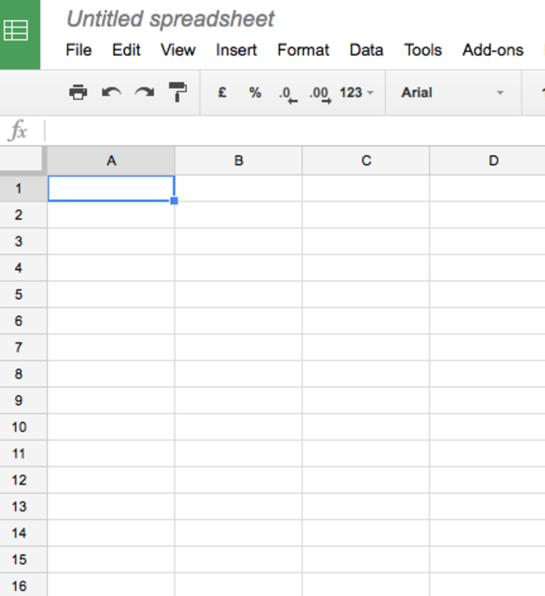
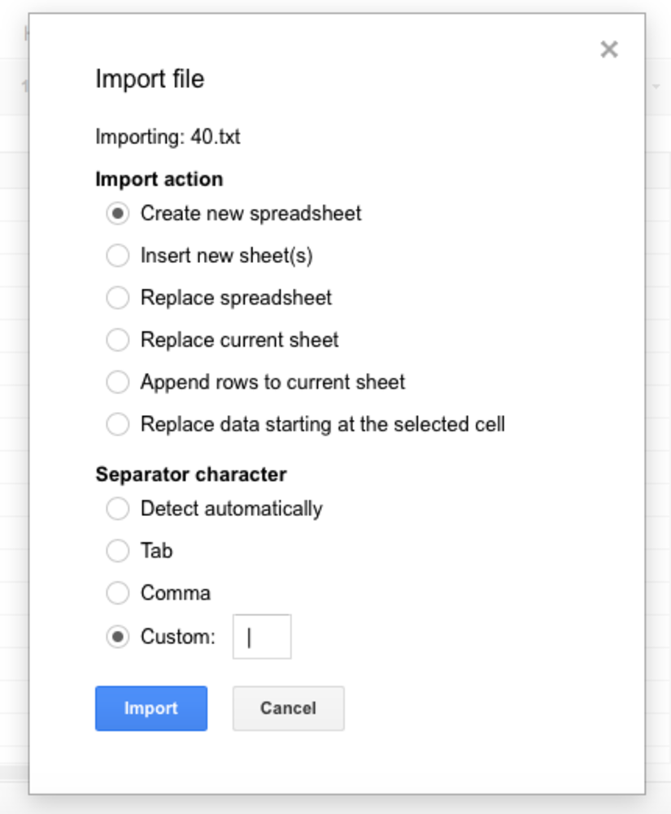
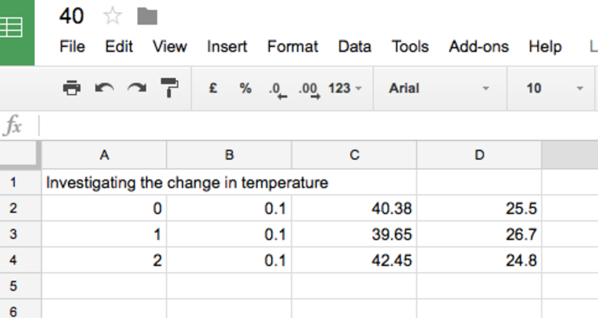
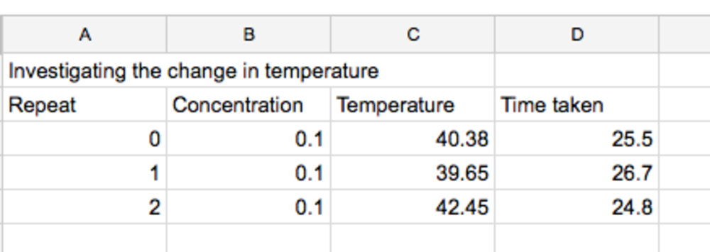
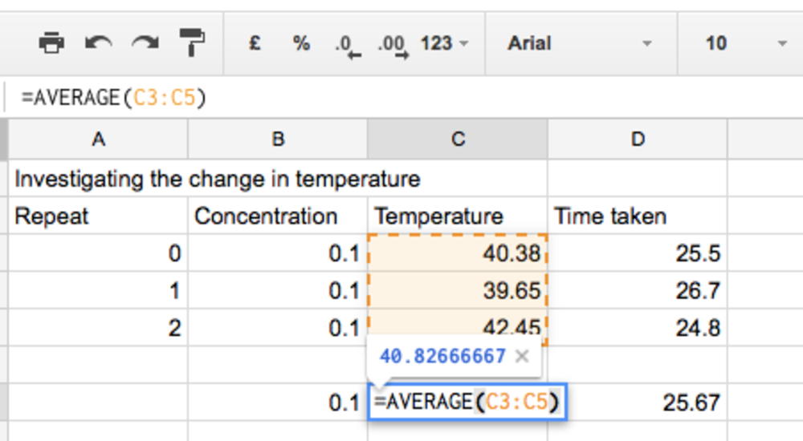
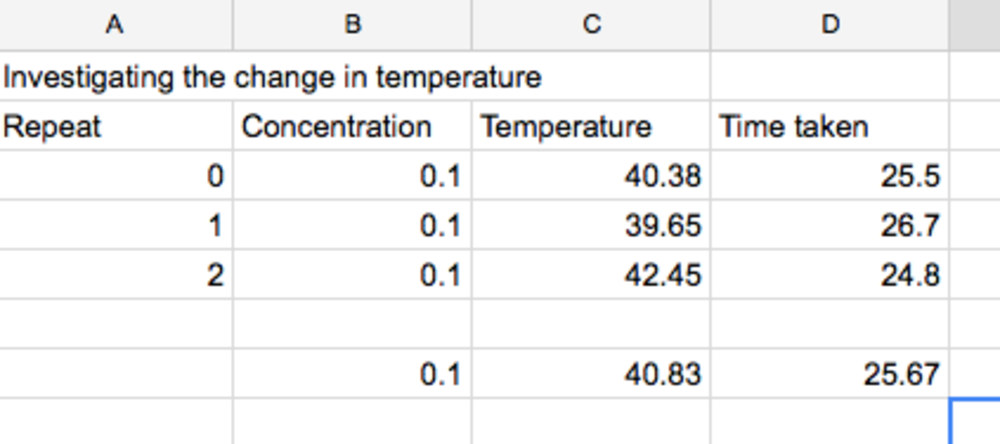

# Investigating rates of chemical reactions

In this lesson, you’re going to investigate how temperature and concentration affect the rate of reaction between sodium thiosulphate and hydrochloric acid.

## Theory 

Chemical reactions happen at different speeds. Experiments can be carried out to investigate how different factors affect the rate of chemical reaction. 

The reaction between hydrochloric acid and sodium thiosulphate produces sodium chloride + sulphur dioxide + sulphur + water. The sulphur is produced as a solid and the reaction causes the mixture to go cloudy. By recording the time taken for the mixture to go cloudy, it is possible to investigate factors which speed up and slow down a chemical reaction.

## Using particles to explain rates of reactions

Before a reaction can occur, the reacting particles must collide with sufficient energy and orientation. The more successful collisions occur, the faster the chemical reaction.

- By increasing the temperature of the reaction mixture the particles are able to move around with more energy, therefore greatly increasing the chances of a successful collision.
- By increasing the concentration of one of the reactants there will be more reacting particles in the mixture.

## Experiment  

Before starting the experiment you will need to decide if you will be investigating temperature or concentration as the dependent variable.

1. Run the Python code and enter the concentration of the sodium thiosulphate solution.
1. Enter the number of repetitions you would like to do for this experiment.
1. Enter a file name for this set of experiments.
1. Place the conical flask on top of the Sense HAT and mix the two reacting solutions. Either press the Enter key on the keyboard or the button on the Sense HAT.
1. As soon as you can no longer see the cross, press the button again.
1. Prepare the next repetition and press the button again to start.
1. Continue until all your repetitions are finished and you get a message saying the experiment is completed.
1. Depending on which variable you are investigating, you should now repeat the steps again by changing the independent variable.

## Analysing results

Using a suitable spreadsheet, import both sets of data and produce a line graph comparing both sets of results.  

### Instructions using Google Sheets

- Log into Google Sheets and start a new sheet:

- Import your results. The pipe symbol `|` has been used to separate each column of results:

- You will now need to tidy up your results by adding column headings:

- Use the average function to calculate the average temperature and time taken:

- You will now have a final set of results for the particular temperature and concentration investigated:

