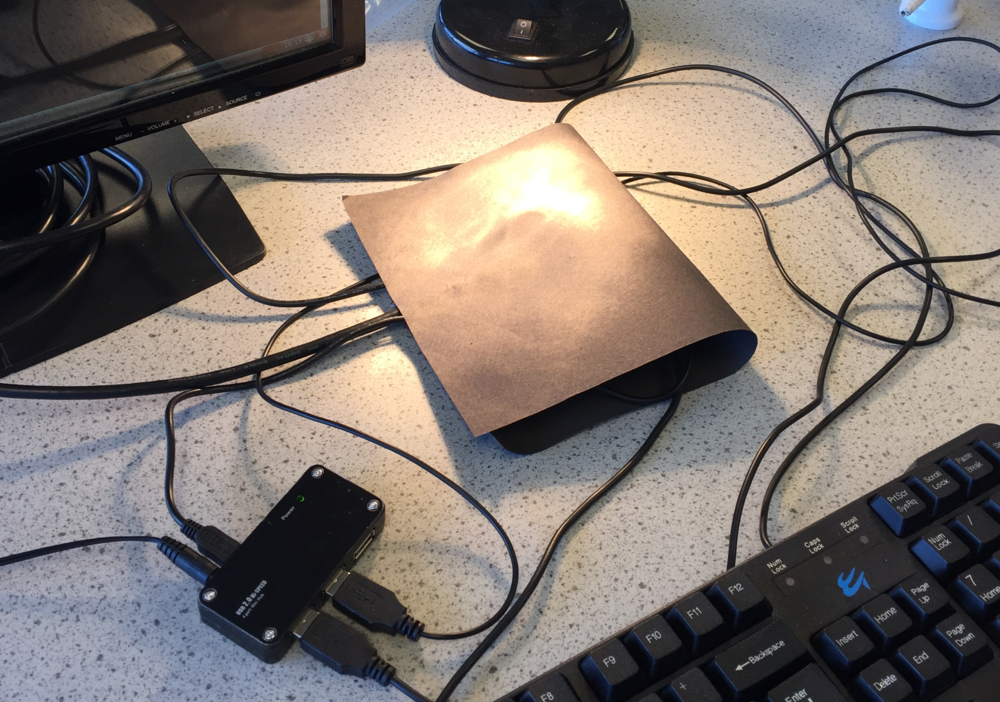
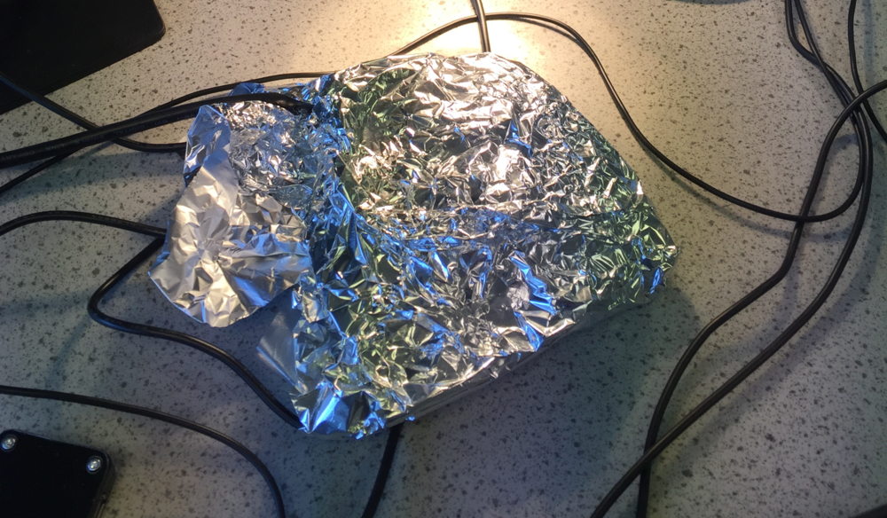

#Black and Silver cans

In this lesson students will investigate the 

##Learning objectives

- Understand that heat can be transfered by hot objects emitting IR radiation
- Understand that different materials emit IR radiation and different rates
- To create cooling curves from CSV data 

##All students are able to

- Measure the temperature of different objects 
- Identify that all hot objects emit IR radiation as they cool

##Most students are able to

- Collect temperature results for different materials
- Identify which materials are the best at emitting IR radiation
- Plot a graph of temperature against time

##Some students are able to

- Explain which surface is the best at emitting IR 
- Explain how different coloured surfaces can be used in real life applications

##Lesson Summary

- Students will set up the Sense HAT to record temperatures of a hot water bottle cooling
- Students will record temperatures of silver and black objects cooling down
- Students will plot a scatter graph of their results from a CSV file recorded during the experiment

##Starter

- Ask students to describe which 

##The Data Logger

- To access the resources for this investigation, open a LXTerminal and type `sudo python3 cooling.py`

##Measuring 

1. Explain to students that the Sense HAT contains sensors that can measure temperature

1. Set the apparatus up to measure the temperature of the Sense HAT as it cools down.  The heat source for this experiment will be a hot water bottle. Other surfaces can be used and a risk assessment should be performed before starting the experiment.

##Carrying out the experiment

1. Heat up water in a kettle and fill up the hot water bottle carefully ensuring than any air is released before screwing the lid on.
1. Wrap a Raspberry Pi in a sandwich bag.
1. Wrap the Raspberry Pi in black paper.
  
1. Start the code and enter a suitable filename for the results.
1. Allow the Raspberry Pi and Sense HAT to warm up for approximately ten minutes
1. When instructed, remove the heat source and rewrap the Pi
1. Enter the number of results required and the interval between each measurement.
1. Leave the Raspberry Pi and Sense HAT to cool down.
1. Once the results have been collected, they will be written to a file which can be analyzed with Excel.
1. Replace the black paper with silver foil and repeat the steps above.

##Analysis of the results

- Once the results have been saved the file can be accessed by importing into a spreadsheet or by printing out the raw data file.
- Students to plot a graph of the temperature against time for the black and silver can.

##Plenary

- Ask students to identify which material cooled down the quickest.
- What does this tell us about the emitting of Infrared radiation

##Extension

- Replace the silver foil with other insulating materials such as cotton wool.

##Risk assessment

In addition to the points below, a full risk assessment should be carried out by institution using this experiment.

- The Raspberry Pi and Sense HAT must be placed in a sandwich bag to avoid any water touching the equipment.
- When wrapping the Sense HAT and Raspberry Pi in silver foil, it is important to prevent a short circuit by first wrapping the Pi in a non-conductive material such as clingfilm.
