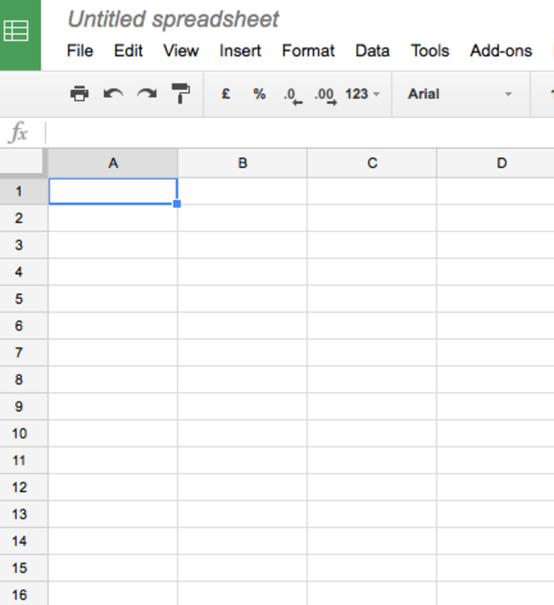
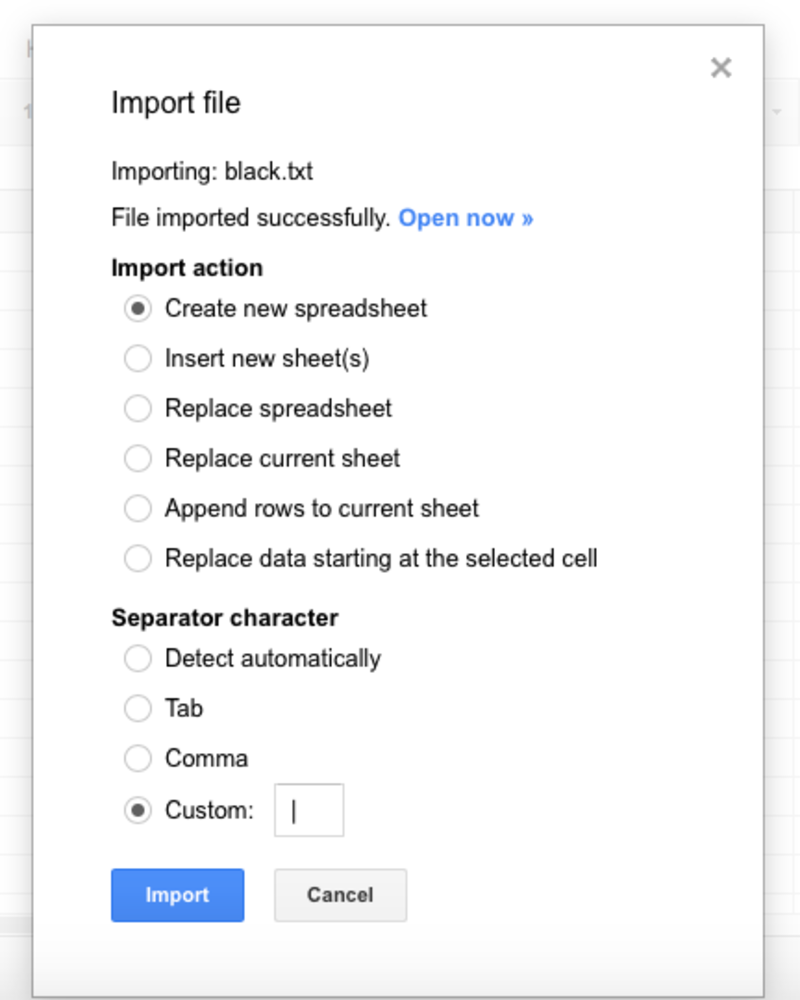
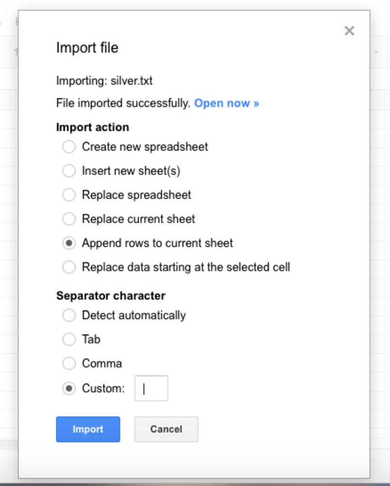
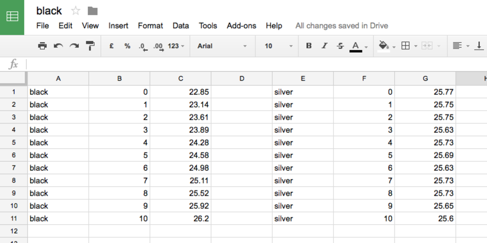
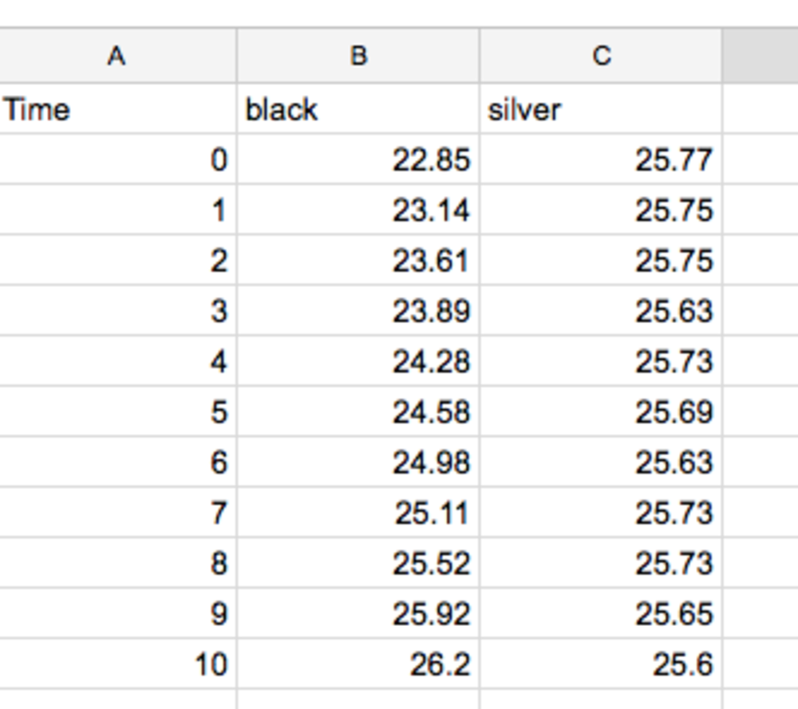
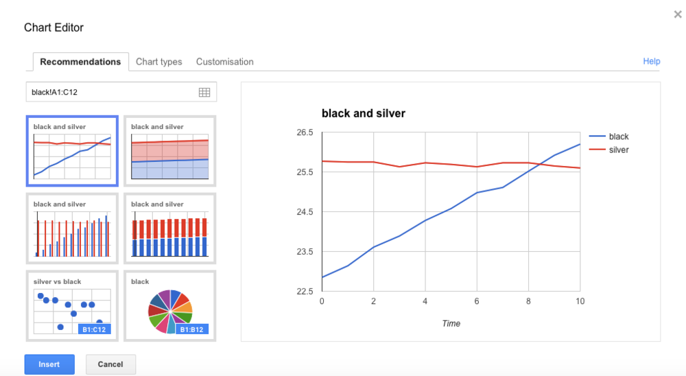
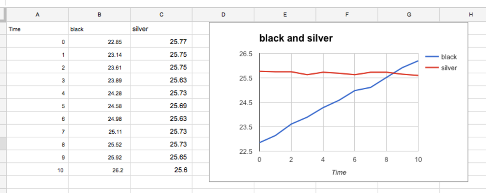

#Black and Silver cans (Investigating Heat transfer by radiation)

In this lesson you are going to investigate how the colour of a surface affects the emitting of IR radiation.

##Theory 

Different colour surfaces emit different amounts of Infra Red radiation.  During this practical we will find out which colour surfaces emits the most radiation.

##Experiment  

1. Heat up water in a kettle and fill up the hot water bottle carefully ensuring than any air is released before screwing the lid on.
1. Wrap a Raspberry Pi in a sandwich bag.
1. Wrap the Raspberry Pi in black paper.
1. Start the code and enter a suitable filename for the results.
1. Allow the Raspberry Pi and Sense Hat to warm up for approximately 10 minutes
1. When instructed remove the heat source and rewrap the Pi
1. Enter the number of results required and the interval between each measurement.
1. Leave the Raspberry Pi and Sense Hat to cool down.
1. Once the results have been collected they will be written to a file which can be analyzed with Excel.
1. Replace the black paper with silver foil and repeat the steps above.

##Extension

Using a suitable spreadsheet import both sets of data and produce a line graph comparing both sets of results.  

Instructions using Google Sheets

- Log into Google Sheets and start a new sheet

- Import the first set of results. The pipe symbol | has been used to separate each column of results.

- Import the second set of results and again use the pipe symbol | to separate each column of results.  This time append the rows to the current sheet.

- You will now have two sets of results on the same sheet.  Copy and paste the second set of results and tidy up the column heading and remove rows no longer needed.

- Highlight both sets of results and the time and select new chart

- You will now have a finished chart which you can now use to write a conclusion identifying which material warmed up the quickest and was the best at absorbing IR radiation.

