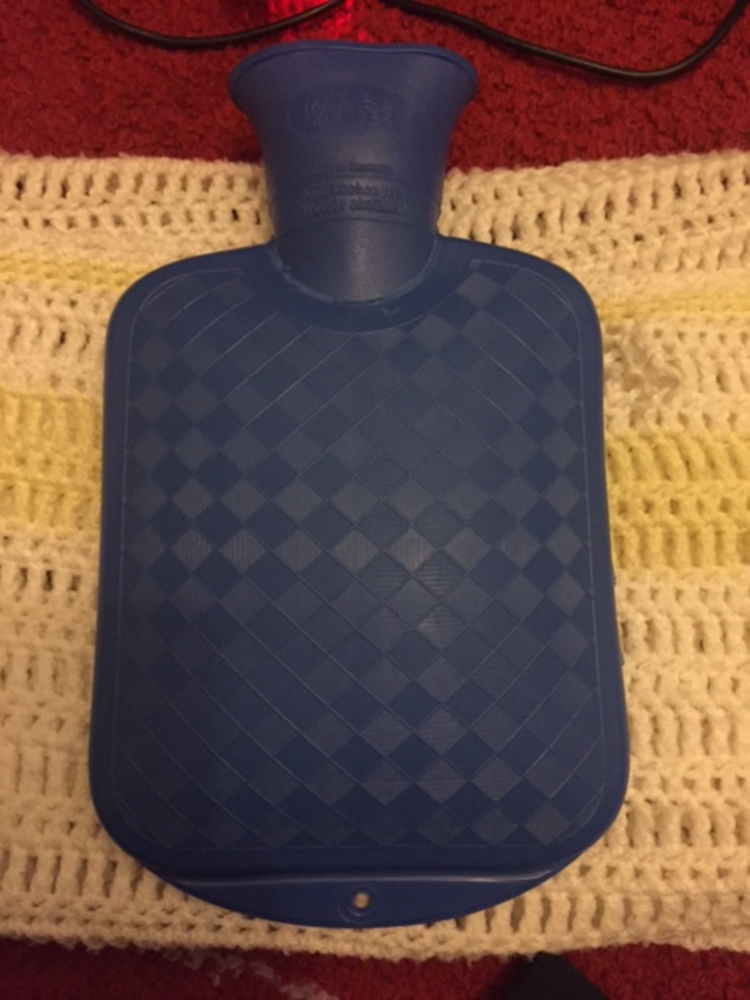
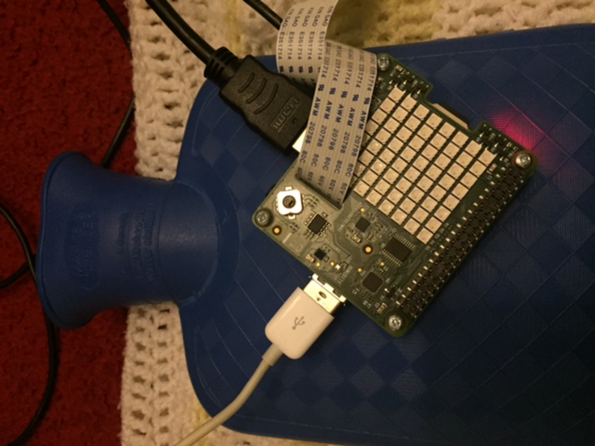
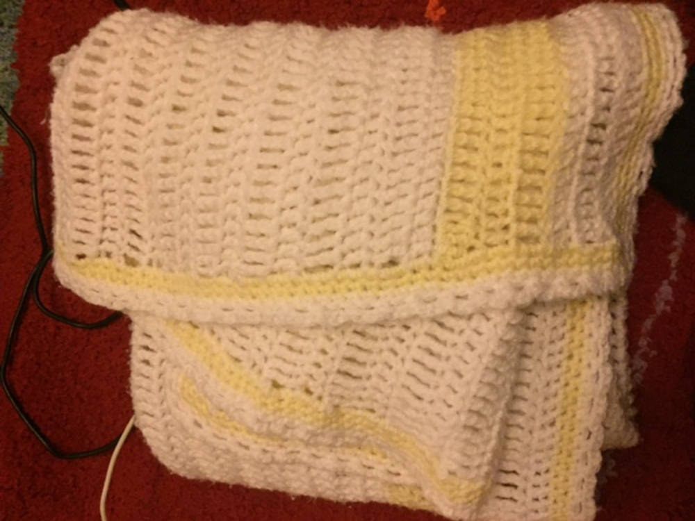
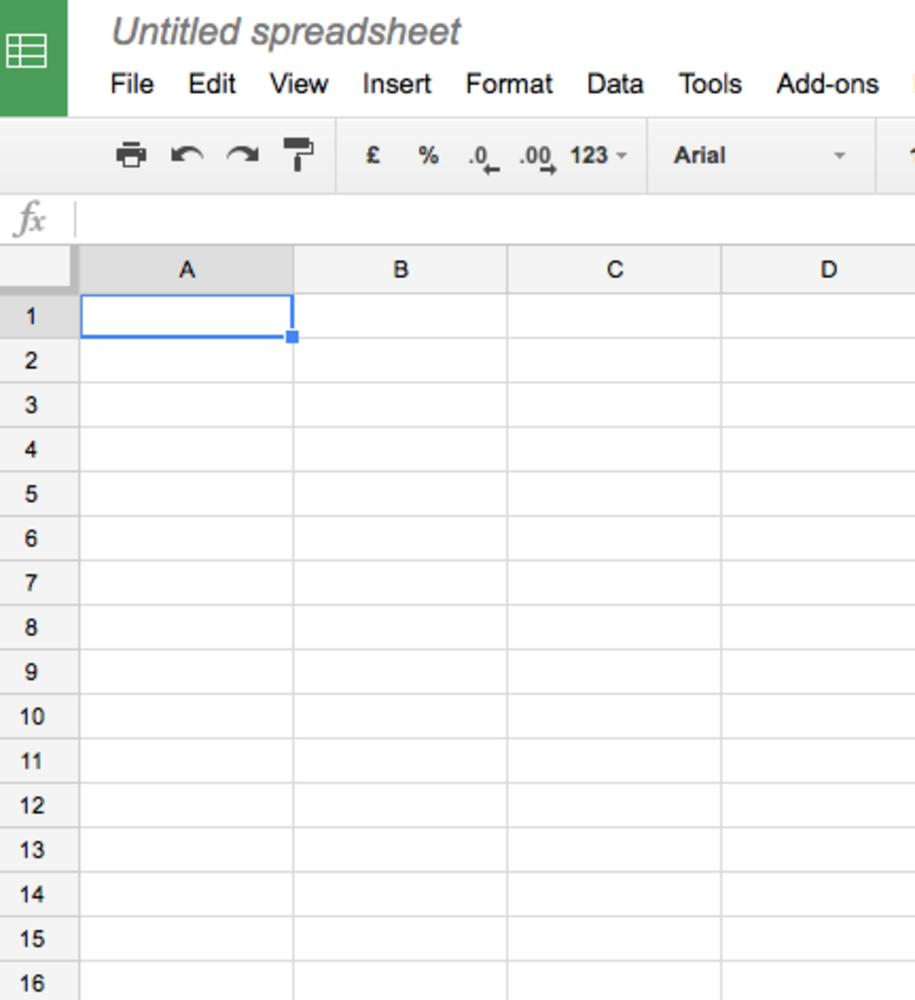
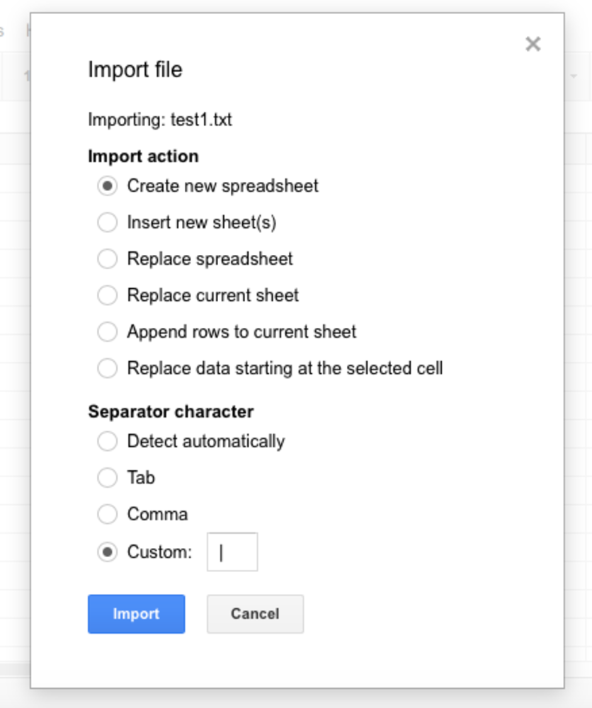
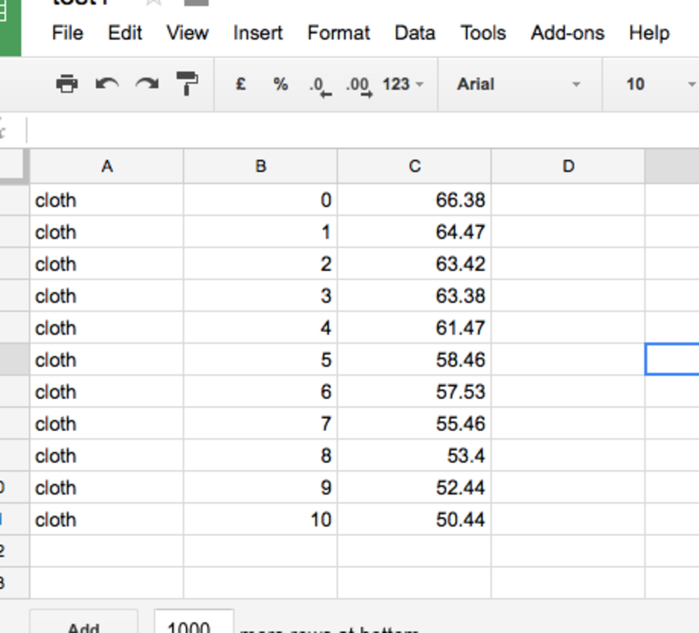
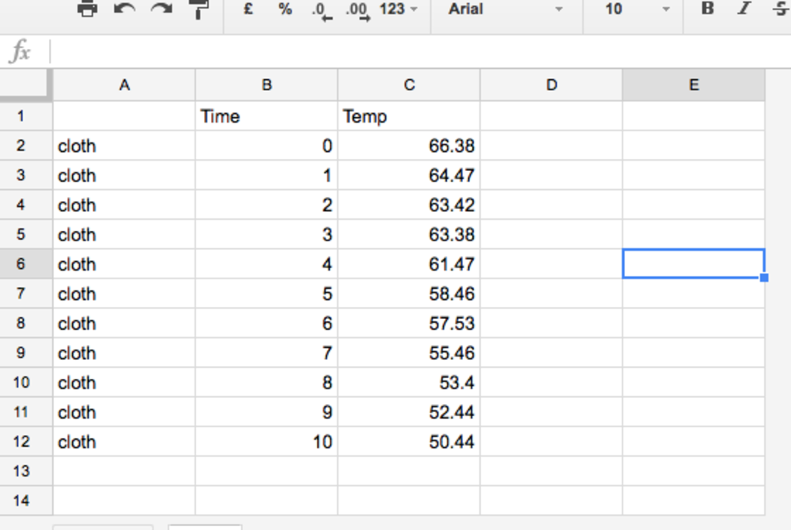
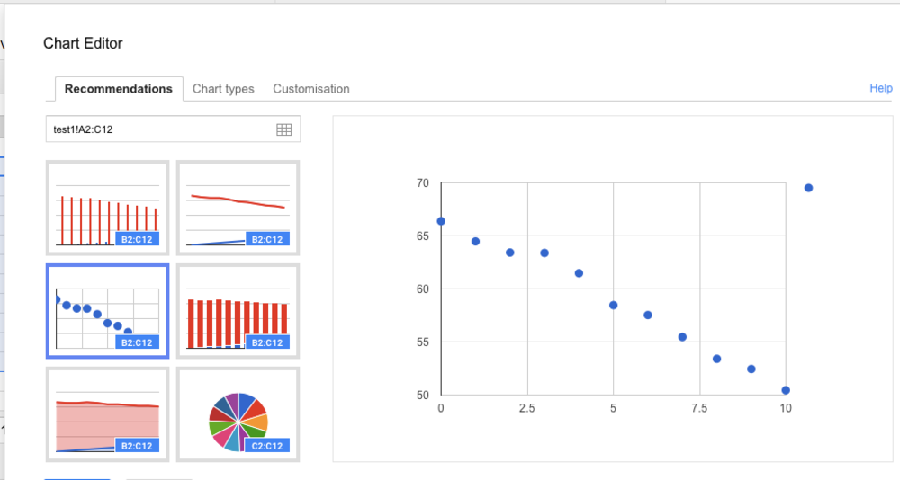

#Keeping baby warm

In this lesson you are going to investigate how good different materials are at preventing heat loss.

##Theory 

Heat is lost from hot objects.  Sometimes we want to stop this heat being lost and we can use a material called an insulator.  In this investigation we will find out what types of materials make the best insulators and can be used to keep a new born baby warm.

##Experiment  

1. Heat up water in a kettle and fill up the hot water bottle carefully ensuring than any air is released before screwing the lid on.
1. Wrap a Raspberry Pi in a sandwich bag.
1. Wrap the Raspberry Pi in a material to keep the baby warm.
1. Start the code and enter a suitable filename for the results.
1. Enter the number of results required and the interval between each measurement.
1. Allow the Raspberry Pi and Sense Hat to warm up for approximately 10 minutes
1. When instructed remove the heat source and rewrap the Pi
1. Leave the Raspberry Pi and Sense Hat to cool down.
1. Once the results have been collected they will be written to a file which can be analyzed with Excel.
1. Repeat with a range of different materials.  Start with a fresh hot water bottle each time.

##Extension

Using a suitable spreadsheet import your data and produce a line graph showing how the material cooled down.

Instructions using Google Sheets

- Log into Google Sheets and start a new sheet

- Import the first set of results. The pipe symbol | has been used to separate each column of results.

- Add column headings to your data.  Remember unless you asked the Raspberry Pi to wait one minute between the results the time wont necessarily be in minutes.

- Highlight your results and the time and select new chart

- Repeat this with each set of results you have obtained from testing different materials.

Questions to think about

- Which material cooled down the quickest.
- Which materials were the best insulators?
- Which materials would you recommend using to keep baby warm?

