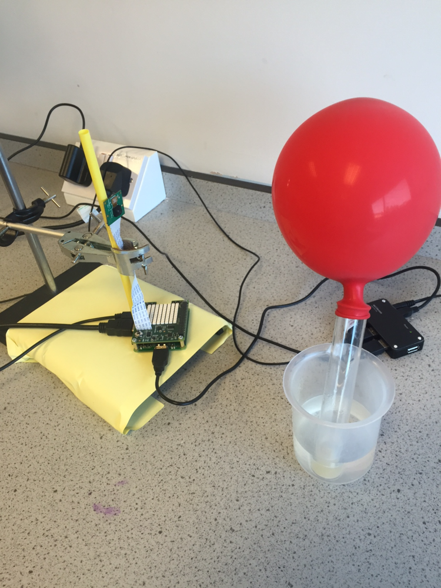
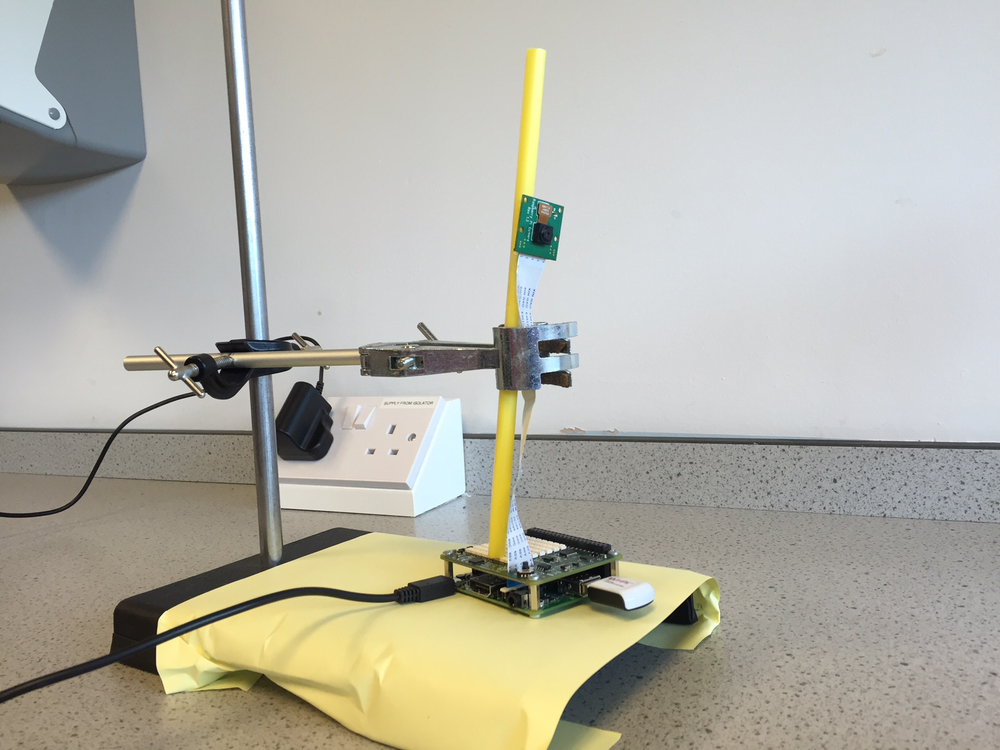
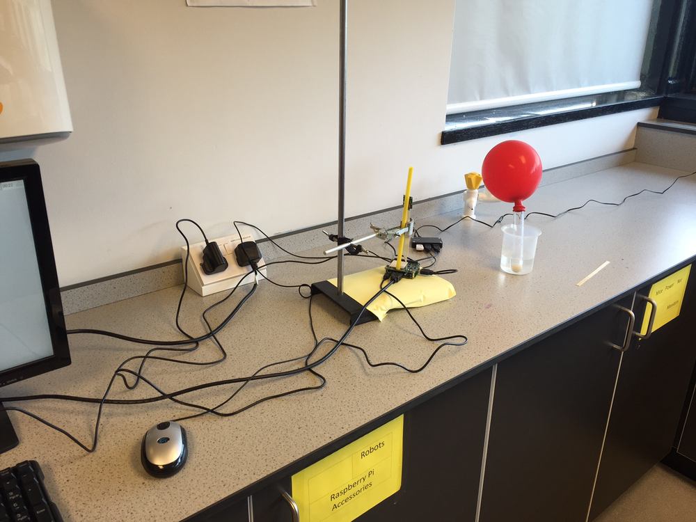

#Investigating Fermentation of Yeast

In this lesson we will investigate what how temperature affects the rate of fermentation of sugar using yeast.

##Learning objectives

- To plan and carry out an investigation into the optimum conditions for the fermentation of yeast

##All students are able to

- Identify that sugar is converted to alcohol during fermentation using yeast.
- Identify that carbon dioxide is produced during this reaction.

##Most students are able to 

- Write a word equation for the fermentation of glucose.
- Measure the volume of carbon dioxide produced during the fermentation of glucose.

##Some students are able to

- Explain how temperature affects the fermentation of glucose.

##Lesson Summary

- Students will carry out an investigation to find out the optimum temperature for the fermentation of yeast 

##Starter

- Recap on fermentation and the chemical reaction which happens during the conversion of sugar (glucose) to alcohol (ethanol).
- Set the scene that a small microbrewery wants to maximise their beer production by finding out the optimum temperature to keep their fermentation mixture at.
- Explain to the students that the brewer is often away from his brewery during the day time so needs a method of collecting data when he is not there.

##The Data Logger

- To access the resources for this investigation.

From LXTerminal type: `sudo python3 fermentation.py`


##Carrying out the experiment

- Collect a 250 ml conical flask and ensure that you can fit a balloon over the opening.

- Measure out 100 ml of apple juice and add a couple of heaped spatulas of sugar and mix well.
- Add approximately 50 ml of freshly prepared yeast solution.
- Attach the balloon to the conical flask and place in a water bath at 25 degrees centigrade
- Start the python code 
- Leave the flask in the water bath for the next hour
- Mount the Raspberry Pi camera in a clamp stand.  In this example I have attached it to a drinking straw.

- The Raspberry Pi will take a photo of the reaction mixture every 5 minutes for 1 hour

- Open the folder called lesson-7 and copy all the photos onto a memory card into a folder ready for analysis later.
- Copy the photos into a different folder on your memory stick
- Repeat the experiment and increase the water bath to 30 degrees centigrade.
- Repeat again until you get to 50 degrees centigrade.

##Analysis of the results

- Open the folder called science_task5, there will be a timelapse series of photos for each temperature.
- Using a ruler measure the maximum diameter of the balloon in each photo and record on a table. Each photo was taken with a 5 minute interval.
- Plot a graph of balloon diameter against time for each temperature. 

##Plenary


- What is the connection between the temperature of the brewing mixture and the time taken to inflate the balloon?

##Extension

- Repeat the experiment but vary the quantity of apple juice / yeast and sugar used.

##Risk assessment

- Check with students to see if anyone is allergic to handling yeast.  
- The alcohol produced during this fermentation practical must not be sampled under any circumstance.

