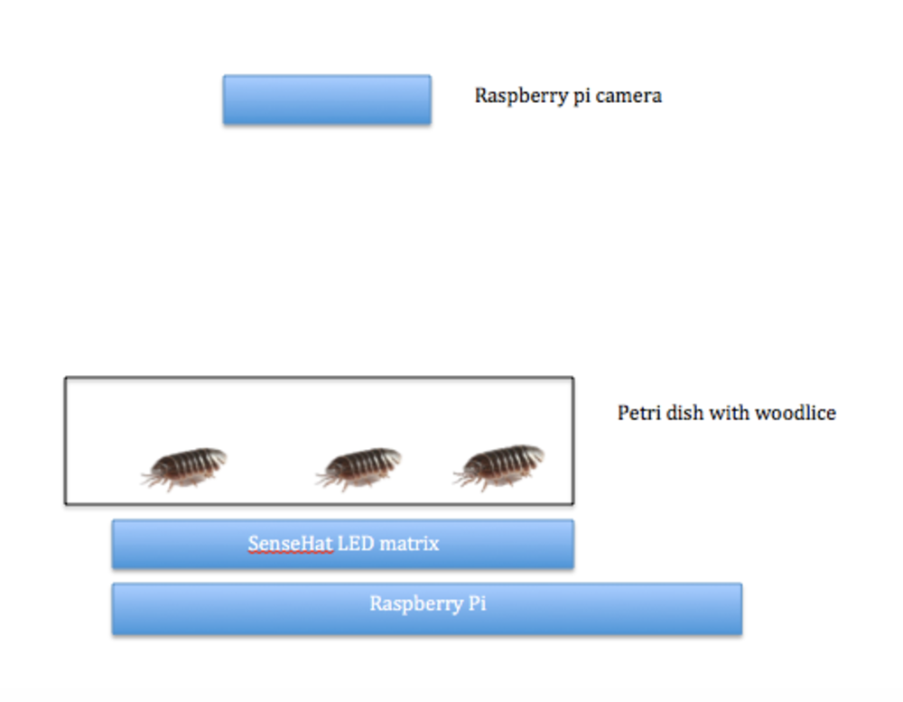

#Investigating choice chambers and insect habitats

In this lesson we will investigate what colour habitats are preferred by different insects

##Theory 

Different insects prefer different places or habitats to live.  Over time it is possible to track changes in insects as they have become adapted to survive in different areas.
During this investigation we will investigate if the colour of light influences the movement and position of woodlice, beetles or maggots.

##Read this carefully before starting your experiment

During this practical you will be using living insects.  After handling any living animal / insect it is advisable that you wash your hands before eating.  
Please also take extra care with your specimens, if any escape try to put them back into the petri dish before they are injured.

Experimenting on animals in science

In this experiment we are experimenting with animals rather than on animals. Animal experiments are widely used to produce new medicines and to check the safety of others. 
We must take extra care in our experiment to treat our insect with respect and to cause it no extra stress or harm.

##Experiment  

- Collect your insect species and place them into a sealed clean petri dish.  Ensure that you have suitable water and vegetation for the insect you will be studying,
- Place the petri dish on top of the LED matrix.  
- Place the Raspberry Pi camera above the LED matrix pointing down towards the insects.
- Start the program choice_chambers.py
- The LED matrix will cycle through the following colours.  After thirty seconds to allow the insects to settle the camera will take two photos 5 seconds apart.

Colour patterns

- 100% white
- 50% white and 50% off
- 25% white and 75% off
- 100% red
- 50% red and 50% off
- 25% red and 75% off
- 100% blue
- 50% blue and 50% off
- 25% blue and 75% off
- 100% green
- 50% green and 50% off
- 25% green and 75% off
- 50% green and 50% blue
- 50% green and 50% red
- 50% red and 50% blue

##Analysis of results

- Open the folder containing science_task6.  There will be two photos taken with each experiment.
- Produce a tally chart to count how many insects are in section from the photos.

- Is there sufficient results to identify a clear pattern?

In a real study involving living things there will be much more data collected to make sure that the results are reliable.
Try comparing your results with another group to see if you get a similar pattern.

##Extension

- Edit the code to change the patterns / colours used.
- Does the insect make a difference?
