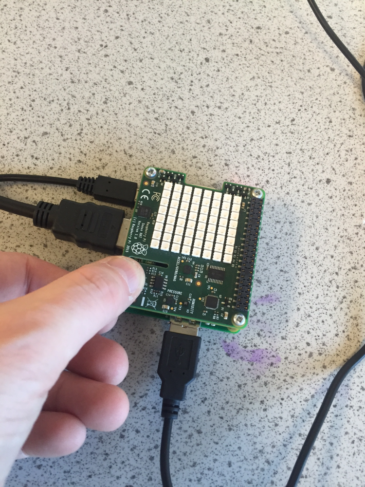

#Investigating stopping distances of cars

In this lesson, you will measure your reaction time and use it to investigate the effects of distractions on your driving

##Learning objectives

- To understand that stopping distances of a moving car are affected by both driving conditions and the driver.
 
##All students are able to

- Describe how the stopping distance of a car is made up from two components, the thinking distance and braking distance.
- Describe thinking distance as the distance travelled while reacting to a stimulus.
- Describe braking distance as the distance travelled while braking.
- Identify the factors that affect thinking distance.

##Most students are able to

- Explain the factors that effect the thinking distance of a driver performing an emergency stop.
- Investigate a range of factors affecting their reaction times.

##Some students are able to

- Evaluate the factors affecting reaction times.

##Lesson Summary

- As part of a lesson on car safety and stopping distances, students are able to simulate an emergency stop at different speed limits and use the data to calculate their own thinking distance.

##Starter

- Show students a range of carefully selected video clips to highlight the importance of road safety. Brainstorm the factors that might affect how quickly it is possible to stop your car in an emergency.

##The Data Logger

- To access the resources for this investigation, open LXTerminal and type: `sudo python3 reaction_times.py`


##Setting up the data logger.

1. Enter the class name. This will become the file name for the saved data.
1. Enter a speed limit such as 70 mph (as on a motorway or fast dual carriage way).
1. Invite the students to come to the Raspberry Pi one at a time to obtain their results.

##Carrying out the experiment

- Enter your name when prompted on the screen.
- Press the enter key or the button the Sense HAT when you are ready to start.

- The green traffic light will come on between 3 and 10 seconds.
- As soon as you see the red traffic light appear either press the button on the Sense HAT or the enter key on the keyboard.
- Your result will be logged.
- Make a note of how quick your time was and how far you would have travelled.
- Are you surprised about how far you travelled in that time period?

##Analysis of the results

- The file can be imported into a spreadsheet and used in a number of ways.
- Students can produce a bar chart of the results for the class identifying students with the fastest and slowest reaction times.
- Have a discussion about the results. Are the students surprised about the distance travelled in such a short time?

##Plenary


Use the results to produce a written response about the factors affecting stopping distance.

##Extension

- The same program can be used to investigate different factors that might affect your stopping distance.
- Run the program again and enter the number of attempts you would like to investigate.
- Instead of entering a student name enter a description of your distraction.
- Some distractions could include:
 - having a conversation with a friend as you carry out the test
 - try it at the end of a school day when you are tired
 - try sending a text with the other hand at the same time
 - try listening to loud / fast / quiet music
 - try reading from a sheet of paper

##Risk assessment

Whilst there is no risk assessment required for this activity, it is worth considering the following points.

- Are there students in the class who have a medical need which could affect their reaction time? Sensitivity should be exercised for these students.
- Are there students in the class who may be affected by talking about car safety and accidents?
