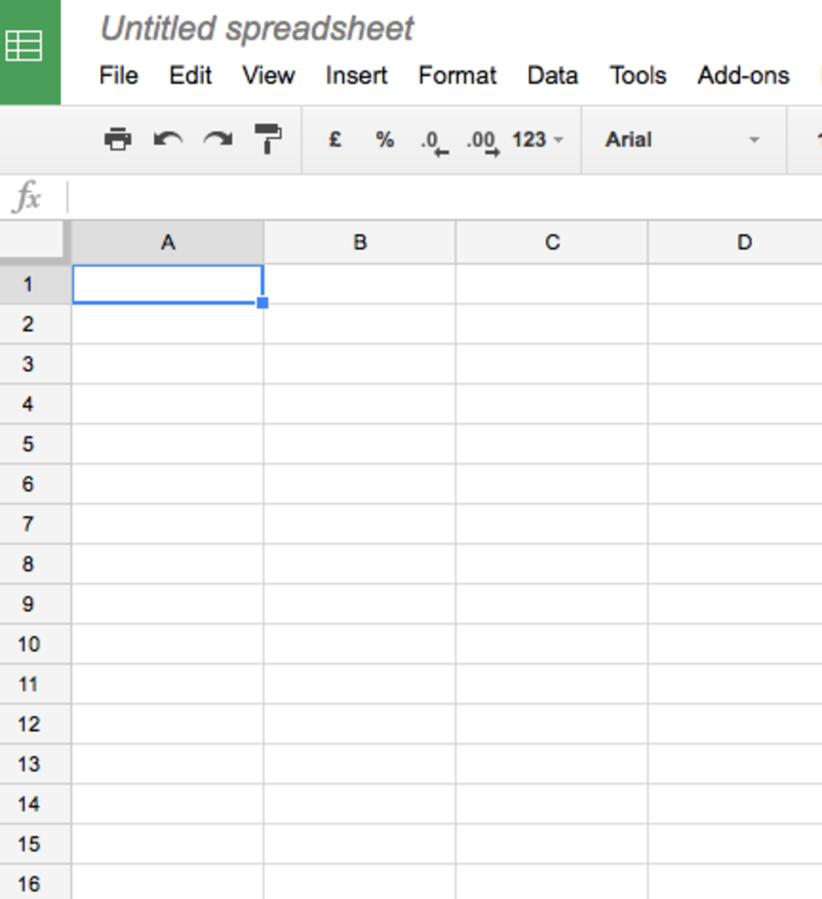
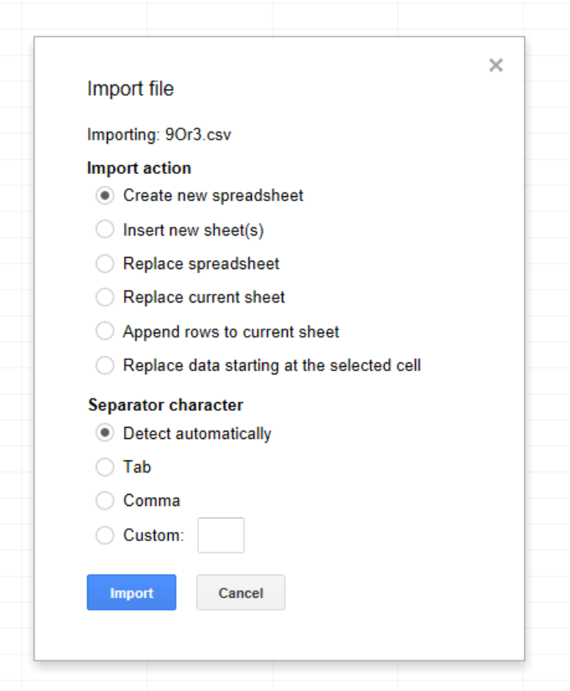
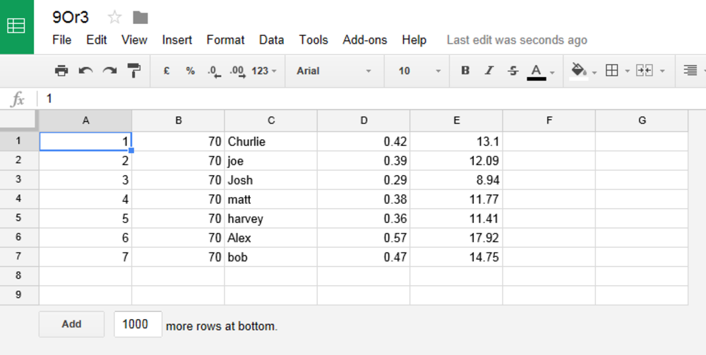
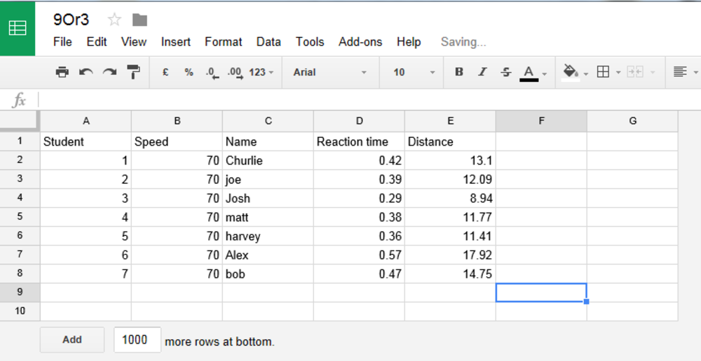
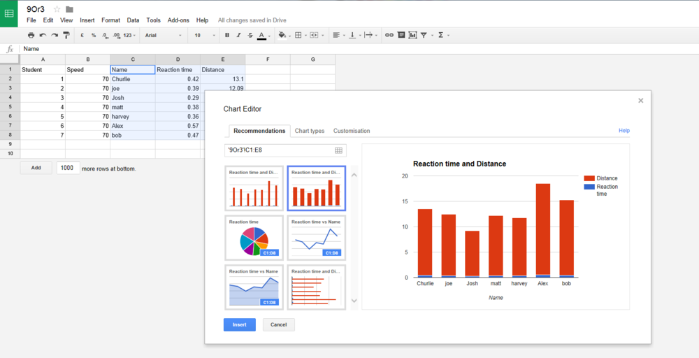
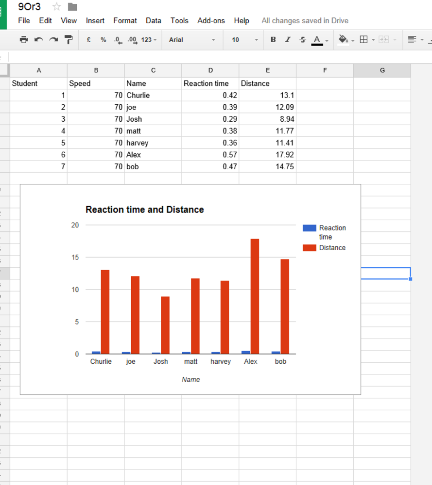

# Investigating stopping distances of cars

In this lesson, you will measure your reaction time and use it to investigate the effects of distractions on your driving.

## Theory 

The stopping distance of a car is made up of two components: the thinking distance and the braking distance. You can calculate the stopping distance by adding together the thinking distance and the braking distance.

- The thinking distance is the distance the car will travel while you react to a stimulus, such as the cars in front of you applying their brakes.
- The braking distance is affected by factors such as road conditions, and the quality of tyres and brakes on the car.

In this experiment you will measure the time it takes to react to a stimulus, and the Raspberry Pi will calculate how far you would have travelled in that time at different speeds.

## Experiment  

- The class teacher will start the code and enter the number of students in the class.
- Your teacher will have entered a speed limit such as 70 mph, as on a motorway or fast dual carriageway.
- Enter your name when prompted on the screen.
- Press the Enter key or the button on the Sense HAT when you are ready to start.
- The green traffic light will come on between 3 and 10 seconds.
- As soon as you see the red traffic light appear, either press the button on the Sense HAT or the Enter key on the keyboard.
- Your result will be logged.
- Make a note of how quick your time was and how far you would have travelled.
- Are you surprised at how far you travelled in that time period?

## Analysing results

Using a suitable spreadsheet, import both sets of data and produce a bar chart graph comparing the results from the class.  

- Log into Google Sheets and start a new sheet:

- Import your results. The pipe symbol `|` has been used to separate each column of results:

- You will now need to tidy up your results by adding column headings:

- Highlight the name, reaction time, and distance columns and insert a new chart:

- Select a suitable bar chart and add it to your document:

## Extension

- The same program can be used to investigate different factors that might affect your stopping distance.
- Run the program again and enter the number of attempts you would like to investigate.
- Instead of entering a student name, enter a description of your distraction.
- Some distractions could include:
  - having a conversation with a friend as you carry out the test
  - doing the test at the end of a school day when you are tired
  - trying to send a text with the other hand at the same time
  - trying to listen to loud/fast/quiet music
  - trying to read from a sheet of paper or look at a map

